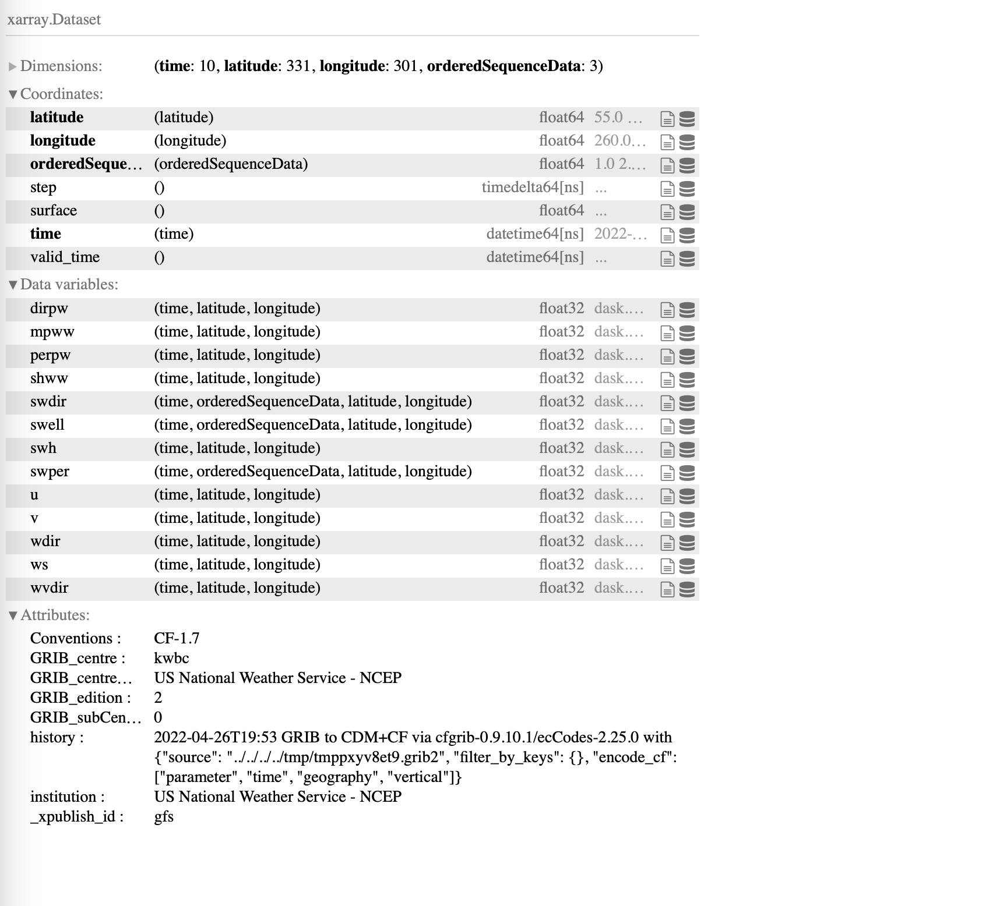
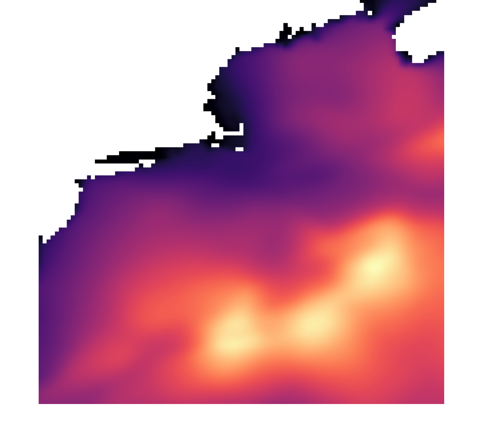

# restful-grids
Exploring modern RESTful services for gridded data

## Resources
Use this S3 bucket for test data: `s3://ioos-code-sprint-2022`
Several zarr datasets have been added to it. It also contains a static STAC catalog for identifying the data.

## Setup
[Miniconda](https://docs.conda.io/en/latest/miniconda.html) is recommended to manage Python dependencies.  

In the Anaconda prompt, you can load the `environment.yml` file to configure your environment:
`conda env create -f environment.yml`

Once you install the environment, you will need to activate it using

`conda activate code-sprint-2022`

To update your conda environment with any new packages added or removed to the `environment.yml` file use

`conda env update -f environment.yml --prune`

Alternatively, you can install dependencies with `pip` and `virtualenv`: 

```bash
virutalenv env/
source env/bin/activate
pip install -r requirements.txt
```

## Taking a Look at the Notebook Example
We have an example notebook in the `/examples` directory, which can be run using the `enivronment.yml` file
- [Link to rendered notebook](https://nbviewer.org/github/asascience/restful-grids/blob/main/examples/demo-apis.ipynb)

## Running This Work-In-Progress

Once you install your environment, you can run your local server with the:
- Wave Watch 3 (ww3) dataset, which can be downloaded [here]()
- Global Forecast System (GFS) in Zarr format hosted on the cloud

Once you have your data, use following steps:

### Start the Server
You can start the server using the `main.py` in the `/xpublish` directory

```
cd xpublish
python main.py
```

This will spin up a server, accessible using the following link (localhost:9005):

```
INFO:     Uvicorn running on http://0.0.0.0:9005 (Press CTRL+C to quit)
INFO:     Started reloader process [5152] using statreload
INFO:     Started server process [5155]
INFO:     Waiting for application startup.
INFO:     Application startup complete.
```

When you go to the web address, you you will see a page specifying which datasets are available

```
["ww3","gfs"]
```

We can look at the GFS dataset, by adding `/datasets/gfs` to the url, which results in a web-rendered version of the dataset



### Subset a Point

One of the methods of accessing data is using the data point API, using something similar to the following:

```
localhost:9005/datasets/ww3/edr/position?coords=POINT(-69.35%2043.72)%27&parameter-name=hs,dir,t02
```

Which returns a [json](https://www.json.org/json-en.html) file with the desired data:


```json
{"type":"Coverage","domain":{"type":"Domain","domainType":"Grid","axes":{"x":{"values":[-69.30000305175781]},"y":{"values":[43.70000076293945]},"t":{"values":["2022-04-11T12:00:00","2022-04-11T12:59:59","2022-04-11T14:00:00","2022-04-11T15:00:00","2022-04-11T15:59:59","2022-04-11T17:00:00","2022-04-11T18:00:00","2022-04-11T18:59:59","2022-04-11T20:00:00","2022-04-11T21:00:00","2022-04-11T21:59:59","2022-04-11T23:00:00","2022-04-12T00:00:00","2022-04-12T00:59:59","2022-04-12T02:00:00","2022-04-12T03:00:00","2022-04-12T03:59:59","2022-04-12T05:00:00","2022-04-12T06:00:00","2022-04-12T06:59:59","2022-04-12T08:00:00","2022-04-12T09:00:00","2022-04-12T09:59:59","2022-04-12T11:00:00","2022-04-12T12:00:00","2022-04-12T12:59:59","2022-04-12T14:00:00","2022-04-12T15:00:00","2022-04-12T15:59:59","2022-04-12T17:00:00","2022-04-12T18:00:00","2022-04-12T18:59:59","2022-04-12T20:00:00","2022-04-12T21:00:00","2022-04-12T21:59:59","2022-04-12T23:00:00","2022-04-13T00:00:00","2022-04-13T00:59:59","2022-04-13T02:00:00","2022-04-13T03:00:00","2022-04-13T03:59:59","2022-04-13T05:00:00","2022-04-13T06:00:00","2022-04-13T06:59:59","2022-04-13T08:00:00","2022-04-13T09:00:00","2022-04-13T09:59:59","2022-04-13T11:00:00","2022-04-13T12:00:00","2022-04-13T12:59:59","2022-04-13T14:00:00","2022-04-13T15:00:00","2022-04-13T15:59:59","2022-04-13T17:00:00","2022-04-13T18:00:00","2022-04-13T18:59:59","2022-04-13T20:00:00","2022-04-13T21:00:00","2022-04-13T21:59:59","2022-04-13T23:00:00","2022-04-14T00:00:00","2022-04-14T00:59:59","2022-04-14T02:00:00","2022-04-14T03:00:00","2022-04-14T03:59:59","2022-04-14T05:00:00","2022-04-14T06:00:00","2022-04-14T06:59:59","2022-04-14T08:00:00","2022-04-14T09:00:00","2022-04-14T09:59:59","2022-04-14T11:00:00","2022-04-14T12:00:00"]},"forecast_reference_time":{"values":["2022-04-11T12:00:00"]}},"referencing":[]},"parameters":{"hs":{"type":"Parameter","observedProperty":{"label":{"en":"significant height of wind and swell waves"}},"description":{"en":"significant height of wind and swell waves"},"unit":{"label":{"en":"m"}}},"dir":{"type":"Parameter","observedProperty":{"label":{"en":"wave mean direction"}},"description":{"en":"wave mean direction"},"unit":{"label":{"en":"degree"}}},"t02":{"type":"Parameter","observedProperty":{"label":{"en":"mean period T02"}},"description":{"en":"mean period T02"},"unit":{"label":{"en":"s"}}}},"ranges":{"hs":{"type":"NdArray","dataType":"float","axisNames":["forecast_reference_time","t"],"shape":[1,73],"values":[0.33467215299606323,0.3588910698890686,0.3660368025302887,0.3152061402797699,0.2875429093837738,0.33364781737327576,0.42414912581443787,0.5218766927719116,0.599566638469696,0.6628382802009583,0.6959347724914551,0.7017455697059631,0.6900897026062012,0.6990023255348206,0.7459676861763,0.8135576248168945,0.8708090782165527,0.9190717339515686,0.9822579026222229,1.0730650424957275,1.1682802438735962,1.2368590831756592,1.2590762376785278,1.2461904287338257,1.2177737951278687,1.190627098083496,1.1743522882461548,1.1686142683029175,1.168257474899292,1.1705492734909058,1.1713541746139526,1.1505155563354492,1.1002039909362793,1.029807448387146,0.9527088403701782,0.8763468265533447,0.8059961199760437,0.7473487257957458,0.6959123611450195,0.6488614678382874,0.6027891635894775,0.5554247498512268,0.5091127157211304,0.4687694013118744,0.4349559545516968,0.40602195262908936,0.3779057264328003,0.3484857380390167,0.3213227689266205,0.30005601048469543,0.2922517955303192,0.3058054745197296,0.34318259358406067,0.39665448665618896,0.4514908790588379,0.4962618947029114,0.5274868011474609,0.5485127568244934,0.5546026825904846,0.5439878106117249,0.5306615829467773,0.521487832069397,0.5167329907417297,0.513405442237854,0.5168517827987671,0.531062662601471,0.5381449460983276,0.5489262938499451,0.570189356803894,0.6079721450805664,0.6753485798835754,0.7782320976257324,0.9024170637130737]},"dir":{"type":"NdArray","dataType":"float","axisNames":["forecast_reference_time","t"],"shape":[1,73],"values":[304.64556884765625,299.618408203125,293.408203125,287.8389892578125,280.72564697265625,269.44873046875,255.81439208984375,244.49017333984375,236.51898193359375,230.26300048828125,225.9736328125,223.1942138671875,221.13653564453125,218.9971923828125,215.77105712890625,211.55718994140625,210.140380859375,211.71331787109375,214.11346435546875,215.63812255859375,215.6729736328125,214.7518310546875,212.01513671875,208.25762939453125,204.655029296875,201.95989990234375,200.77069091796875,201.060302734375,201.87841796875,202.632568359375,203.35174560546875,203.40252685546875,202.67822265625,201.50372314453125,200.7591552734375,200.6708984375,201.12451171875,202.5379638671875,204.12567138671875,205.147216796875,204.88092041015625,202.3099365234375,198.0283203125,194.3463134765625,192.36212158203125,191.99456787109375,191.7603759765625,190.14593505859375,187.52301025390625,184.47686767578125,181.40606689453125,178.68524169921875,176.647705078125,175.54791259765625,175.24810791015625,175.56658935546875,176.4949951171875,178.193603515625,178.86566162109375,178.3890380859375,177.8448486328125,177.36468505859375,177.0433349609375,176.85498046875,175.67352294921875,174.07855224609375,173.53839111328125,173.0093994140625,173.1402587890625,174.214111328125,174.9512939453125,173.96197509765625,171.16070556640625]},"t02":{"type":"NdArray","dataType":"float","axisNames":["forecast_reference_time","t"],"shape":[1,73],"values":[1.8070895671844482,2.1569175720214844,2.2606236934661865,2.272696018218994,2.1709280014038086,2.151611089706421,2.3017566204071045,2.452406644821167,2.5829691886901855,2.69464111328125,2.7830710411071777,2.8376331329345703,2.8641910552978516,2.8558714389801025,2.8827998638153076,2.953688144683838,3.059943675994873,3.1737217903137207,3.3152377605438232,3.4846651554107666,3.6484591960906982,3.765639543533325,3.8690288066864014,3.9598238468170166,4.043913841247559,4.048367500305176,3.98111629486084,3.90596079826355,3.8609814643859863,3.8333399295806885,3.807370662689209,3.8096847534179688,3.8128299713134766,3.805934190750122,3.7544338703155518,3.6700472831726074,3.5692813396453857,3.447746992111206,3.3469176292419434,3.2537217140197754,3.212505578994751,3.2340455055236816,3.3002560138702393,3.3129446506500244,3.226036310195923,3.080014944076538,2.9937071800231934,3.0099799633026123,3.108988046646118,3.356945514678955,3.7293829917907715,4.201430797576904,4.8152899742126465,5.385035037994385,5.667536735534668,5.556057453155518,5.037730693817139,4.278224468231201,4.069947719573975,4.364011287689209,4.786285877227783,5.236138820648193,5.629247188568115,5.760343074798584,4.635284900665283,3.936607837677002,3.8392491340637207,3.6843204498291016,3.5711114406585693,3.5300326347351074,3.4591054916381836,3.4388718605041504,3.4989757537841797]}}}
```

### Subset a Region/Image

The other method of accessing/visualizing data is through the `ImageRouter`, which given a:
- bbox (bounding box) - Lon min, Lat min, Lon max, Lat max
- parameter (which field) - variable name
- height - width of the plot
- width - height of the plot
- cmap - matplotlib colormap
- crs - EPSG projection
- datetime - datetime selection

For example, the following:

http://localhost:9005/datasets/ww3/image/?bbox=-75,35,-65,45&parameter=hs&width=1024&height=1024&cmap=magma&crs=EPSG:4326&datetime=2022-04-12T21:00:00.000000000

Would result in this plot:


